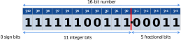

## General Information

*en\_cl\_fix* is a free, open-source, multi-language fixed-point math library for FPGA and ASIC development.

It provides low-level fixed-point functionality in both HDL and software languages. This includes basic arithmetic (addition, multiplication, etc) and number format conversions (with rounding and saturation).

This library supports arbitrary precision, but typically executes faster for bit-widths ≤ 53 bits.

### Supported Languages

The currently supported langauges are:

- VHDL<sup>\*</sup>
- Python
- MATLAB

<sup>\*</sup>All RTL code is VHDL-93 compliant (for maximum compatibility with synthesis toolchains). Testbenches are VHDL-2008 compliant.

SystemVerilog support is under active development in 2024. However, weak toolchain support for SystemVerilog is proving to be a significant barrier.

C++ support will be added if sufficient demand arises. An experimental partial implementation (based on [GMP](https://gmplib.org/)) gave good results.

### Usage Examples

High-level usage examples can be found, for example, in the open-source [psi_fix](https://github.com/paulscherrerinstitute/psi_fix) library, which internally uses *en\_cl\_fix* for its fixed-point arithmetic.

Low-level test cases are included in *en\_cl\_fix* (see [Running Tests](#running-tests)).

## License
This library is free and open-source.

It is published under the [MIT License](https://opensource.org/license/mit), which allows commercial use.

## Maintainers
This library is maintained by [Enclustra GmbH](https://www.enclustra.com/en).

We actively use this library in our own FPGA projects, and have done for more than a decade (as of 2024).

## Changelog
See [Changelog](Changelog.md).

## Dependencies

### Python Dependencies

- Python 3 (tested with >= 3.10)
- Python packages
    - *numpy* (tested with >= 1.24.3)
    - *vunit-hdl* (tested with >= 4.7.0)

The required Python packages can be installed as follows:

```
python -m pip install -r requirements.txt
```

### MATLAB Dependencies

Tested with MATLAB R2023b, and others.

### VHDL Simulator Dependencies

All VHDL simulators supported by [VUnit](https://vunit.github.io/) should work.

Tested with: GHDL 4.1.0, Modelsim ASE 2020.1, Modelsim AE 2020.1, Modelsim ME 2022.2, Modelsim PE 2024.1, Questa FE 2023.4, and others.

## Fixed-Point Number Representation

### Getting Started

It is highly recommended to watch Enclustra's [Fixed-Point Python Co-simulation](https://www.youtube.com/watch?v=DajbzQurjqI&t=346) webinar before working with *en\_cl\_fix*:

[](https://www.youtube.com/watch?v=DajbzQurjqI&t=346)

It covers important background information on fixed-point number representation.

### Fixed-Point Number Format

The fixed-point number format used in this library is defined as follows:

```
[S, I, F]
```

where:

- `S` = Number of sign bits (0 or 1).
- `I` = Number of integer bits.
- `F` = Number of fractional bits.

Therefore, the total bit-width is simply `S`+`I`+`F`.

The contributions of the integer bits and fractional bits in a fixed-point binary number depend on their position relative to the binary point (`I` bits left, `F` bits right). This is the same concept as for an ordinary decimal number (with a decimal point), except with powers of 2 instead of powers of 10. For signed numbers, the (two's complement) sign bit carries a weight of -2<sup>`I`</sup>.

In summary:


**Example**: Interpret `1111110011100011` in fixed-point format `[0, 11, 5]`.

The contributions are:



Therefore, the value is 1024 + 512 + 256 + 128 + 64 + 32 + 4 + 2 + 1 + 1/16 + 1/32 = **2023.09375**.

Some more examples are given below:

| Fixed-Point Format |       Range       | Bit Pattern | Example (in Decimal) | Example (in Binary) |
| :----------------: | :---------------: | :---------: | :------------------: | :-----------------: |
|      [1,2,1]       |    -4 ... +3.5    |    sii.f    |         -2.5         |           101.1     |
|      [1,2,2]       |   -4 ... +3.75    |   sii.ff    |         -2.5         |           101.10    |
|      [0,4,0]       |     0 ... 15      |    iiii.    |          5           |           0101.     |
|      [0,4,2]       |    0 ... 15.75    |   iiii.ff   |         5.25         |          0101.01    |
|      [1,4,-2]      |    -16 ... 12     |   sii--.    |          -8          |           110--.    |
|      [1,-2,4]      | -0.25 ... +0.1875 |    .-sff    |        0.125         |           .-010     |

### Rounding Modes

Rounding behavior is relevant when the number of fractional bits `F` is decreased. This is the same concept as rounding decimal numbers, but in base 2.

Several widely-used rounding modes are implemented in *en\_cl\_fix*. They are summarized below:
<table> 
  <tr>
    <th rowspan="2"> Rounding Mode </th>
    <th rowspan="2"> Description </th>
    <th colspan="6"> Example values, rounded to [1,2,0] </th>
  </tr>
  <tr>
    <th> 2.2 </th> <th> 2.7 </th> <th> -1.5 </th> <th> -0.5 </th> <th> 0.5 </th> <th> 1.5 </th>
  </tr>
  <tr>
    <td> Trunc_s </td>
    <td> Truncate (discard LSBs) </td>
    <td> 2 </td> <td> 2 </td> <td> -2 </td> <td> -1 </td> <td> 0 </td> <td> 1 </td>
  </tr>
  <tr>
    <td> NonSymPos_s </td>
    <td> Non-symmetric round to +infinity </td>
    <td> 2 </td> <td> 3 </td> <td> -1 </td> <td> 0 </td> <td> 1 </td> <td> 2 </td>
  </tr>
  <tr>
    <td> NonSymNeg_s </td>
    <td> Non-symmetric round to -infinity </td>
    <td> 2 </td> <td> 3 </td> <td> -2 </td> <td> -1 </td> <td> 0 </td> <td> 1 </td>
  </tr>
  <tr>
    <td> SymInf_s </td>
    <td> Symmetric round "outwards" to +/- infinity </td>
    <td> 2 </td> <td> 3 </td> <td> -2 </td> <td> -1 </td> <td> 1 </td> <td> 2 </td>
  </tr>
  <tr>
    <td> SymZero_s </td>
    <td> Symmetric round "inwards" to zero </td>
    <td> 2 </td> <td> 3 </td> <td> -1 </td> <td> 0 </td> <td> 0 </td> <td> 1 </td>
  </tr>
  <tr>
    <td> ConvEven_s </td>
    <td> Convergent rounding to even </td>
    <td> 2 </td> <td> 3 </td> <td> -2 </td> <td> 0 </td> <td> 0 </td> <td> 2 </td>
  </tr>
  <tr>
    <td> ConvOdd_s </td>
    <td> Convergent rounding to odd </td>
    <td> 2 </td> <td> 3 </td> <td> -1 </td> <td> -1 </td> <td> 1 </td> <td> 1 </td>
  </tr>
</table>

`Trunc_s` is the most resource-efficient mode, but introduces the largest rounding error. Its integer equivalent is `floor(x)`.

`NonSymPos_s` is the most common general-purpose rounding mode. It provides minimal rounding error and is resource-efficient. However, it introduces a statistical error bias because all ties are rounded towards +infinity. Its integer equivalent is `floor(x + 0.5)`.

All the other rounding modes differ from `NonSymPos_s` only with respect to how ties are handled (see table above). When statistically unbiased rounding is required, `ConvEven_s` or `ConvOdd_s` is typically used.

### Saturation Modes

Saturation behavior is relevant when the number of integer bits `I` is decreased and/or the number of sign bits `S` is decreased (signed to unsigned).

If saturation is not enabled, then MSBs are simply discarded, causing any out-of-range values to "wrap".

If warnings are enabled, then the HDL simulator or software environment will issue a warning when an out-of-range value is detected.

| Saturation Mode | Saturate? | Warn? |
|-----------------|-----------|-------|
| None_s          | No        | No    |
| Warn_s          | No        | Yes   |
| Sat_s           | Yes       | No    |
| SatWarn_s       | Yes       | Yes   |

## Running Tests

- Python tests can be found in ./bittrue/tests/python/.
    - Example: `python cl_fix_round_test.py`
- MATLAB tests can be found in ./bittrue/tests/matlab/.
- VHDL testbenches can be found in ./tb/ and are executed from the ./sim/ directory. Any modern simulator supported by [VUnit](https://vunit.github.io/) (see [Dependencies](#dependencies)) should work. Some examples:
    - GHDL example: `python run.py --simulator=ghdl --simulator-path='C:/msys64/mingw64/bin'`
    - Modelsim ASE example: `python run.py --simulator=modelsim --simulator-path='C:/intelFPGA/20.1/modelsim_ase/win32aloem'`
    - Modelsim AE example: `python run.py --simulator=modelsim --simulator-path='C:/intelFPGA/20.1/modelsim_ae/win32aloem'`
    - Modelsim ME example: `python run.py --simulator=modelsim --simulator-path='C:/Microchip/Libero_SoC_v2022.2/ModelSimPro/win32acoem'`
    - Modelsim PE example: `python run.py --simulator=modelsim --simulator-path='C:/modeltech_2024.1/win32pe'`
    - Questa FE example: `python run.py --simulator=modelsim --simulator-path='C:/intelFPGA_pro/24.1/questa_fe/win64'`
